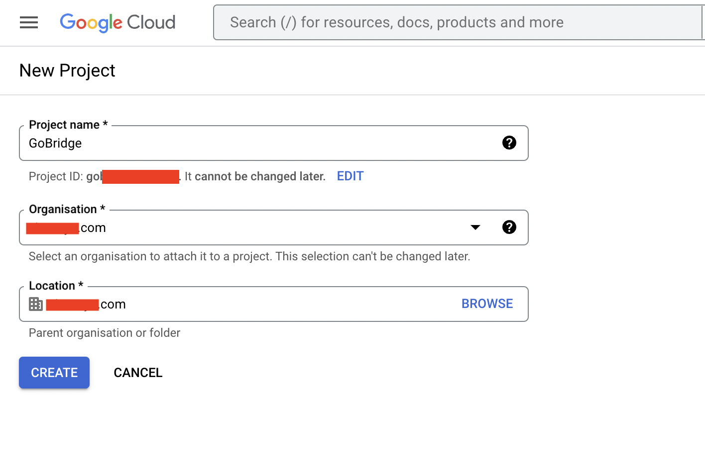
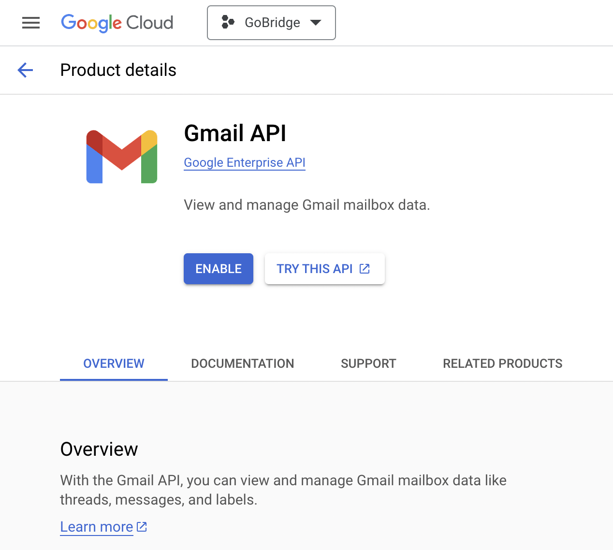
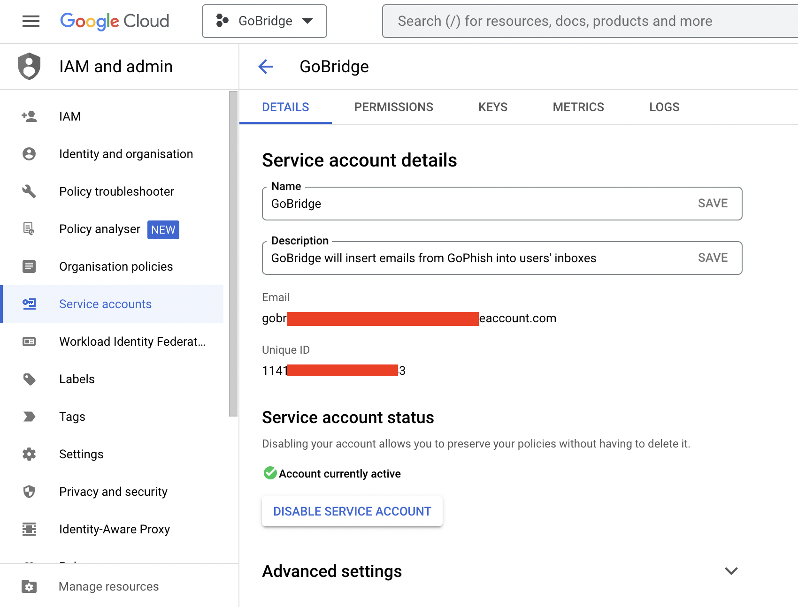
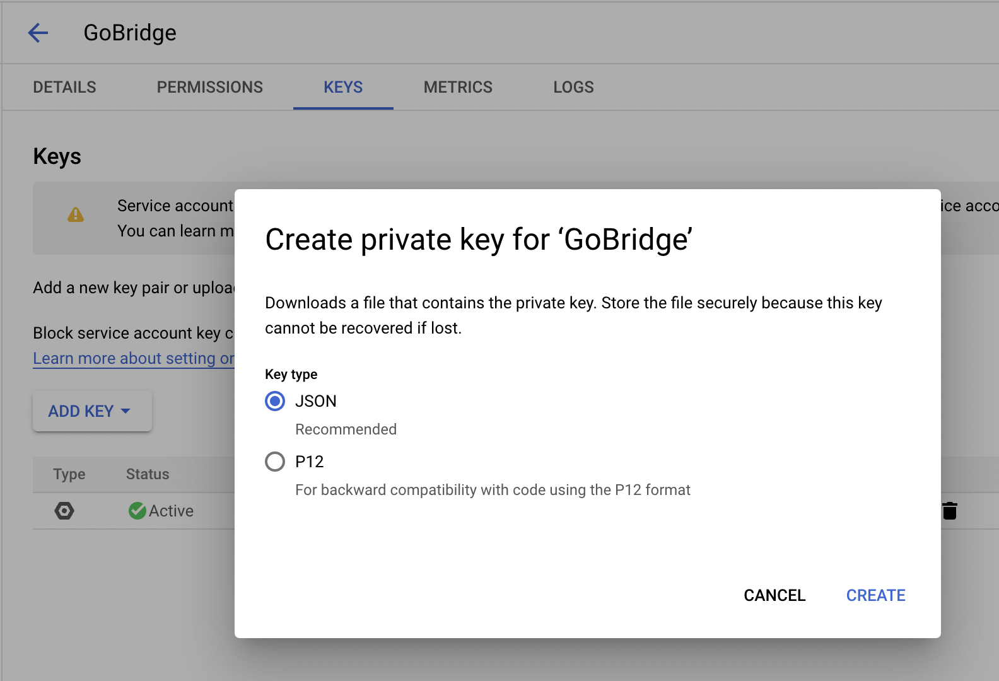
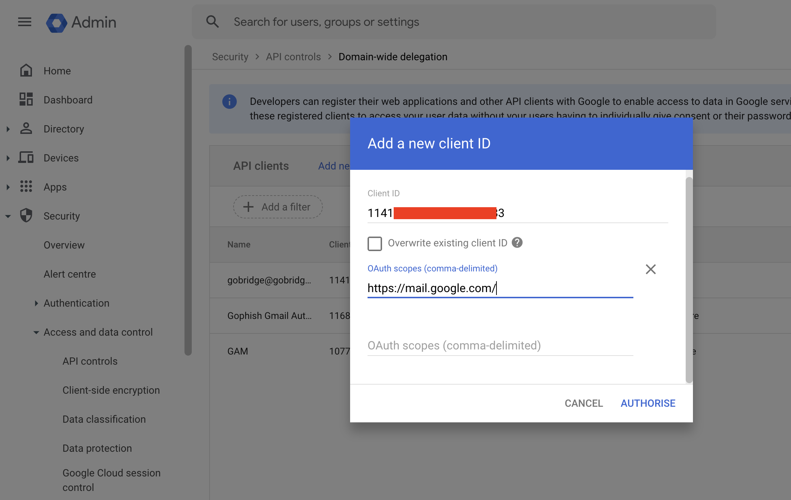

# GoBridge GMail API Setup

This document outlines how to create a new Google project to be used with GoBridge. Broadly speaking; we will create a new project, enable the GMail API for it, create a service account, download th account key, and finally delegate domain-wide authority for the service account. Authorizing a service account to access data on behalf of users in a domain is sometimes referred to as "delegating domain-wide authority" to a service account. This will give permission for the downloaded key to impersonate users (allowing us to insert emails into their inboxes).

## 1. Create a new project

Create a new Google project called 'GoBridge' (or any name you like) via:
https://console.cloud.google.com/projectcreate

## Enable the GMail API

Enable the GMail API for the project you just created via:
https://console.cloud.google.com/apis/library/gmail.googleapis.com

## 3. Create a Service Account

Open the Service accounts page: https://console.developers.google.com/iam-admin/serviceaccounts

1. Select your project

2. Click Create Service Account.

3. Under Service account details, type a name, ID, and description for the service account, then click Create and continue.

4. Click Done.

Make a note of the Unique ID as this will be needed later.

Next, create a service account key:

1. Click the email address for the service account you just created.

2. Click the Keys tab.

3. In the Add key drop-down list, select Create new key.

4. Click Create (choose the JSON option).

Download this key and rename it to 'service_secret.json' and save it in the GoBridge working directory.

## 4. Delegate domain-wide authority to the service account

Go to your Google Workspace domain's Admin Console via: https://admin.google.com/

1. Select Main menu menu > Security > Access and data control > API Controls.

2. In the Domain wide delegation pane, select Manage Domain Wide Delegation.

3. Click Add new.

4. In the Client ID field, enter the service account's Client ID (copied above in step 3.4).

5. In the OAuth scopes (comma-delimited) field, enter https://mail.google.com/

6. Click Authorize

They key downloaded in Section 3 is now ready to be used with GoBridge.